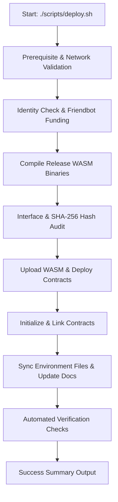

# SponsorChain Deployment Architecture & Operations Guide

This document specifies the technical design, directory structure, execution pipeline, environment variable synchronization, upgrade procedures, and rollback strategies for the SponsorChain Soroban deployment system.

---

## 1. Directory Structure

```
SponsorChain/
├── contracts/                        # Soroban Rust Smart Contracts
│   ├── Cargo.toml                    # Workspace manifest defining sub-crates
│   ├── project-registry/             # ProjectRegistry contract source & tests
│   └── sponsorship-manager/          # SponsorshipManager contract source & tests
├── scripts/                          # Automated Deployment & Verification System
│   ├── deploy.sh                     # Primary CLI deployment entrypoint wrapper
│   ├── deploy-contracts.sh           # Main Soroban contract build/deploy pipeline
│   ├── verify-deployment.sh          # Post-deployment verification utility
│   └── update-env.sh                 # Non-destructive environment updater
├── .github/workflows/                # CI/CD Workflows
│   ├── ci.yml                        # Pull Request & Branch verification workflow
│   ├── deploy-contracts.yml          # GitHub Actions Soroban contract deployment
│   └── deploy-frontend.yml           # Vercel frontend deployment workflow
├── CONTRACTS.md                      # Auto-generated contract deployment record
├── .env.local                        # Local development environment file
├── .env.example                      # Reference template environment file
└── README.md                         # Public repository documentation
```

---

## 2. Deployment Lifecycle Flow

The deployment system executes in 8 sequential phases:



### Step Breakdown
1. **Validation**: Confirms `stellar-cli` and `cargo` toolchains are installed and `STELLAR_NETWORK` is set to `testnet`.
2. **Identity & Funding**: Resolves the deployer identity (`STELLAR_IDENTITY`), generates a local keypair if missing, and automatically requests 10,000 XLM from Testnet Friendbot if account balance is missing.
3. **Compilation**: Invokes `cargo build --locked --target wasm32v1-none --release` to build clean `project_registry.wasm` and `sponsorship_manager.wasm` binaries.
4. **Interface Audit**: Computes deterministic WASM SHA-256 hashes using `stellar contract info hash` and inspects required export function signatures (`unlist_project`, `transfer_maintainer`, `sponsor_with_message`).
5. **Contract Deployment**: Uploads WASM bytecode to Stellar Testnet and instantiates `ProjectRegistry` and `SponsorshipManager` contract addresses (`C...`).
6. **Initialization & Linking**:
   - Invokes `ProjectRegistry.init(admin)`
   - Invokes `SponsorshipManager.init(admin, project_registry, xlm_sac)`
   - Invokes `ProjectRegistry.set_sponsorship_manager(manager)`
7. **Environment Sync**: Uses `./scripts/update-env.sh` to populate contract addresses in `.env.local`, `.env`, and `.env.example` without overwriting unrelated secret keys.
8. **Verification**: Executes `./scripts/verify-deployment.sh` to ping Soroban RPC, Horizon API, validate environment formatting, and query on-chain contract state.

---

## 3. Generated Artifacts

Executing the deployment script produces/updates the following persistent artifacts:

1. `contracts/target/wasm32v1-none/release/project_registry.wasm` - Compiled release WASM bytecode.
2. `contracts/target/wasm32v1-none/release/sponsorship_manager.wasm` - Compiled release WASM bytecode.
3. `CONTRACTS.md` - Complete markdown log of deployed contract IDs, WASM hashes, transaction hashes, Explorer links, and network details.
4. `.env.local` - Updated local environment variables loaded automatically by Next.js.
5. `.env.example` - Public configuration blueprint for developers.

---

## 4. Environment Variable Synchronization

The deployment system ensures zero manual copy-pasting of contract addresses. The non-destructive `update-env.sh` script updates or appends the following keys:

| Key | Description | Default / Example Value |
|-----|-------------|-------------------------|
| `NEXT_PUBLIC_PROJECT_REGISTRY_ADDRESS` | Deployed ProjectRegistry Contract ID | `CB...` |
| `NEXT_PUBLIC_SPONSORSHIP_MANAGER_ADDRESS` | Deployed SponsorshipManager Contract ID | `CC...` |
| `NEXT_PUBLIC_XLM_SAC_ADDRESS` | Native XLM Stellar Asset Contract ID | `CDLZFC3SYJYDVR72C5YAV2LUT55OWW5EL2GY2LPADFCKD2E4L2WDFUX2` |
| `NEXT_PUBLIC_STELLAR_NETWORK` | Target Stellar Network | `TESTNET` |
| `NEXT_PUBLIC_SOROBAN_RPC_URL` | Soroban RPC Endpoint | `https://soroban-testnet.stellar.org` |
| `NEXT_PUBLIC_HORIZON_URL` | Horizon API Endpoint | `https://horizon-testnet.stellar.org` |
| `NEXT_PUBLIC_EXPLORER_BASE` | Stellar Expert Explorer Base URL | `https://stellar.expert/explorer/testnet` |

Unrelated variables (such as `GITHUB_CLIENT_ID`, `NEXTAUTH_SECRET`, `VERCEL_OIDC_TOKEN`, `SENTRY_DSN`) are preserved untouched.

---

## 5. Contract Upgrade Workflow

Soroban contracts support WASM byte-code upgrades while retaining contract storage and contract addresses.

### Upgrading WASM Bytecode (In-Place Upgrade)
1. Modify contract Rust code inside `contracts/project-registry` or `contracts/sponsorship-manager`.
2. Recompile WASM: `cargo build --locked --target wasm32v1-none --release`
3. Upload new WASM bytecode:
   ```bash
   stellar contract upload --wasm target/wasm32v1-none/release/project_registry.wasm \
     --rpc-url https://soroban-testnet.stellar.org \
     --network-passphrase "Test SDF Network ; September 2015" \
     --source sponsorchain-deployer
   ```
4. Record new WASM hash (`NEW_WASM_HASH`).
5. Invoke `update_wasm` method on existing contract address:
   ```bash
   stellar contract invoke --id <EXISTING_CONTRACT_ID> \
     --rpc-url https://soroban-testnet.stellar.org \
     --network-passphrase "Test SDF Network ; September 2015" \
     --source sponsorchain-deployer \
     -- update_wasm --new_wasm_hash <NEW_WASM_HASH>
   ```

---

## 6. Rollback Strategy

If an in-place WASM upgrade exhibits unforeseen issues:

1. Locate the previous audited WASM hash in `CONTRACTS.md` or git history.
2. Invoke `update_wasm` with the previous WASM hash:
   ```bash
   stellar contract invoke --id <EXISTING_CONTRACT_ID> \
     --rpc-url https://soroban-testnet.stellar.org \
     --network-passphrase "Test SDF Network ; September 2015" \
     --source sponsorchain-deployer \
     -- update_wasm --new_wasm_hash <PREVIOUS_WASM_HASH>
   ```
3. Run `./scripts/verify-deployment.sh` to confirm contract functionality.

If a complete fresh deployment was executed, revert `.env.local` to point back to the previous contract addresses recorded in `CONTRACTS.md`.
