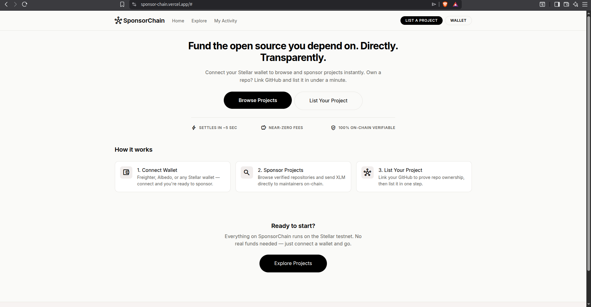
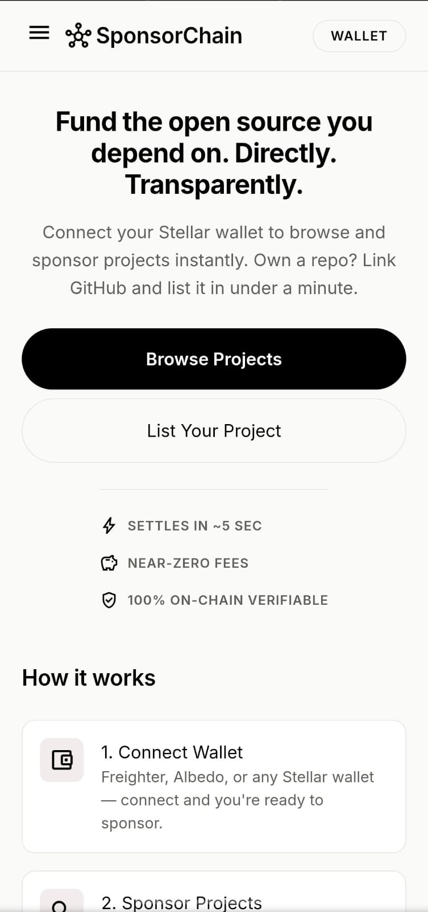
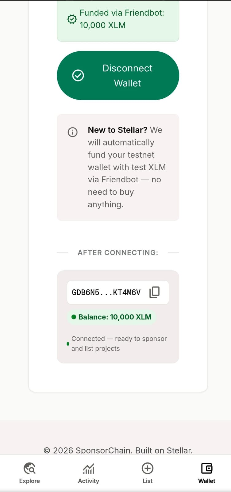
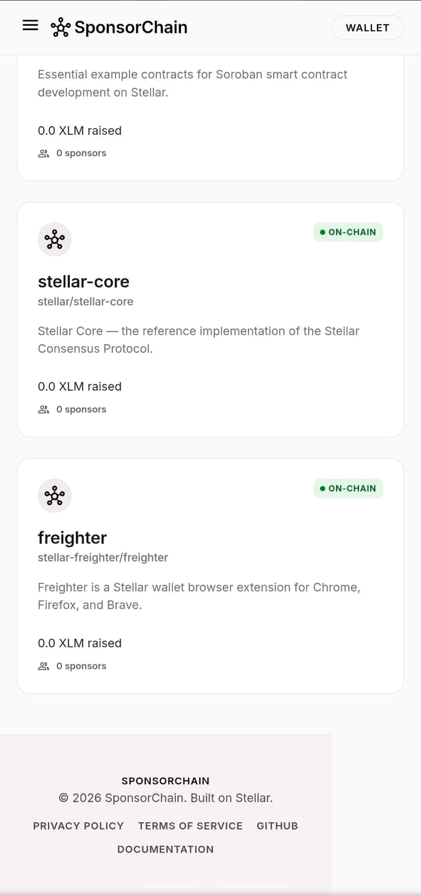
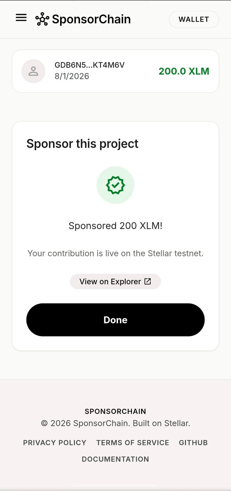
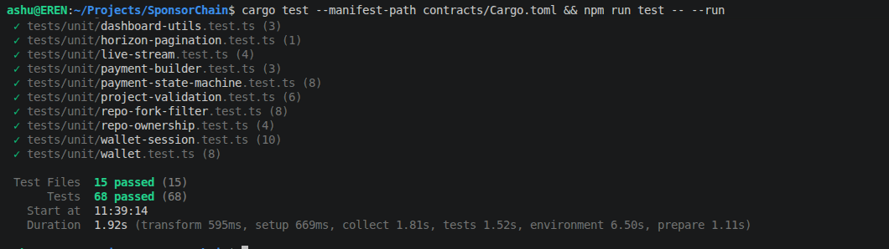

# SponsorChain — Decentralized Sponsor Fund on Stellar

<div align="center">

**[Live Demo](https://sponsorchain.vercel.app)** &nbsp;|&nbsp; **[Demo Video](https://youtu.be/xRrEzkga6AU)** &nbsp;|&nbsp; **[Stellar Explorer](https://stellar.expert/explorer/testnet)**


</div>

---

## Problem Statement

Open source maintainers build and support the digital infrastructure of the global economy, yet the vast majority receive little to no compensation. Existing developer funding portals introduce heavy platform fees, delayed payout cycles, and complex administrative overhead. Furthermore, sponsors have no way to verify that their contributions reach the maintainers directly without intermediaries taking a cut.

## Solution

SponsorChain is a direct peer-to-peer developer sponsorship platform built on the Stellar blockchain. Maintainers verify repository ownership via GitHub OAuth and list public repos on the Soroban smart contracts. Sponsors browse repositories and send XLM directly to the maintainer's wallet address. Every transaction is fee-free, instant, and 100% verifiable on the Stellar blockchain.

---

## Screenshots

### Desktop UI — Maintainer Dashboard


### Mobile Responsive UI
<div align="center">
  
  &nbsp;&nbsp;
  
  &nbsp;&nbsp;
  
  &nbsp;&nbsp;
  
</div>

### CI/CD Pipeline


### Test Output — 68 Passing Tests


---

## Contract Information

| Field | Value |
|-------|-------|
| Network | Stellar Testnet |
| ProjectRegistry Contract | `CBNWNLUIZWJA3E2AXYAVSAIKMW4MLKIKP6YO74UJX7DW5VGETCFMX6EB` |
| SponsorshipManager Contract | `CBRRVROJJDW22CMFBHOV5IS4UFC3V3KTDSC6SBU43NWXR33VLBK5J32U` |
| Native XLM SAC | `CDLZFC3SYJYDZT7K67VZ75HPJVIEUVNIXF47ZG2FB2RMQQVU2HHGCYSC` |
| ProjectRegistry Init Tx | `e164f9e2730d27cbf4150cf61fd76dd3bcb634baa88a125013e461be4728075d` |
| Linking Registry to Manager Tx | `2ba8e86d9e627c0622e7eea49be5403f5cf502b04546cb86fda6df6f27572be8` |
| SponsorshipManager Init Tx | `d77e3f60faf0a6eeed264dc0fd3d9527a6029c5484dc155f57a8f3ec2133b689` |

- [Verify ProjectRegistry on Explorer](https://stellar.expert/explorer/testnet/contract/CBNWNLUIZWJA3E2AXYAVSAIKMW4MLKIKP6YO74UJX7DW5VGETCFMX6EB)
- [Verify SponsorshipManager on Explorer](https://stellar.expert/explorer/testnet/contract/CBRRVROJJDW22CMFBHOV5IS4UFC3V3KTDSC6SBU43NWXR33VLBK5J32U)

---

## How It Works

**For Maintainers:**
1. Connect your Stellar wallet (Freighter) on the dashboard.
2. Link your GitHub account to verify ownership of your repositories.
3. Select an eligible public, non-fork repository you own.
4. Input details, review, sign the transaction via Freighter, and publish on-chain.
5. Track received sponsorships in the Received tab of your dashboard.

**For Sponsors:**
1. Connect your Stellar wallet.
2. Browse listed projects on the Explore page.
3. Click on a project, input the amount of XLM to sponsor, and sign via Freighter.
4. XLM is transferred directly to the maintainer's wallet address in under 5 seconds.

---

## Features

- **Direct P2P payments**: Payments go directly from the sponsor's wallet to the maintainer's wallet. No middleman treasury or platform fee.
- **On-chain source of truth**: All project details and sponsorship totals are stored directly on-chain inside Soroban contract state.
- **GitHub Verification**: NextAuth.js OAuth flows verify repository ownership at listing time to prevent impersonation.
- **Freighter Wallet Integration**: Secure client-side signing of transactions directly in the browser.
- **Live Horizon Streaming**: Listens to payments on Horizon via Server-Sent Events (SSE) to update dashboards in real-time.
- **Mobile Responsive Layout**: Premium look and feel adapting seamlessly from desktop to mobile screens.
- **Fully Tested Suite**: Robust quality gate with 68 passing tests.

---

## Tech Stack

| Layer | Technology |
|-------|------------|
| Frontend | Next.js 15 (App Router) + React 19 |
| Styling | Tailwind CSS |
| Wallet Kit | `@creit.tech/stellar-wallets-kit` (Freighter, Albedo, xBull, Lobstr, Rabet) |
| Blockchain | Stellar Testnet |
| Smart Contracts | Soroban (Rust + `soroban-sdk` v27) |
| SDK | `@stellar/stellar-sdk` |
| Testing | Vitest + Testing Library |
| CI/CD | GitHub Actions |
| Deployment | Vercel |

---

## Getting Started

### Prerequisites
- Node.js 18+
- [Freighter Wallet](https://www.freighter.app/) set to **Testnet**
- Rust 1.84+ with `wasm32v1-none` target (if editing contracts)

### Installation

```bash
git clone https://github.com/ashuujha/SponsorChain.git
cd SponsorChain
npm install
```

### Environment Setup
Create a `.env.local` file at the root:

```env
NEXTAUTH_SECRET="YOUR_NEXTAUTH_SECRET"
NEXTAUTH_URL="http://localhost:3000"
GITHUB_CLIENT_ID="YOUR_GITHUB_CLIENT_ID"
GITHUB_CLIENT_SECRET="YOUR_GITHUB_CLIENT_SECRET"
NEXT_PUBLIC_PROJECT_REGISTRY_ADDRESS="CBNWNLUIZWJA3E2AXYAVSAIKMW4MLKIKP6YO74UJX7DW5VGETCFMX6EB"
NEXT_PUBLIC_SPONSORSHIP_MANAGER_ADDRESS="CBRRVROJJDW22CMFBHOV5IS4UFC3V3KTDSC6SBU43NWXR33VLBK5J32U"
```

Refer to [`GITHUB_SETUP.md`](./GITHUB_SETUP.md) to register your GitHub OAuth application.

### Start local server
```bash
npm run dev
```

Open `http://localhost:3000`

---

## Running Tests

### Frontend (Vitest)
```bash
npm run test -- --run
```

68 tests passing across 15 files:

| Scope | File | Tests | Covers |
|-------|------|-------|--------|
| Unit | `wallet.test.ts` | 8 | freighter installation, connection & network logic |
| Unit | `wallet-session.test.ts` | 10 | wrong-network state and persistence-across-reload |
| Unit | `repo-fork-filter.test.ts` | 8 | fork check logic at repository fetch |
| Unit | `repo-ownership.test.ts` | 4 | repo ownership verification utilities |
| Unit | `project-validation.test.ts` | 6 | form description length & name validator checks |
| Unit | `payment-state-machine.test.ts` | 8 | donation flows, idle, review, pending & success transitions |
| Unit | `payment-builder.test.ts` | 3 | XLM amount and public key format validation |
| Unit | `live-stream.test.ts` | 4 | Horizon SSE stream reconnects and fallback to polling |
| Unit | `horizon-pagination.test.ts` | 1 | pagination parsing helper tests |
| Unit | `dashboard-utils.test.ts` | 3 | project grouping & metrics calculations |
| Integration | `wallet-connect.test.tsx` | 4 | wallet connection states, Freighter disconnect |
| Integration | `onboarding-flow.test.tsx` | 1 | repository selection and project detail prep |
| Integration | `payments-flow.test.tsx` | 2 | project detail page rendering and review overlays |
| Integration | `list-project-flow.test.tsx` | 5 | multi-step wizard state flow transitions |
| Integration | `verification.test.ts` | 1 | Horizon client connection health check |

### Contracts (Rust)
```bash
cargo test --manifest-path contracts/Cargo.toml
```

---

## CI/CD Pipeline

The GitHub Actions workflow runs on every push and PR to `main`:
1. **Contracts Job**: Sets up stable Rust toolchain, installs target `wasm32v1-none`, builds contracts, and executes `cargo test`.
2. **Frontend Job**: Installs dependencies, runs code linter and typecheck, executes 68 Vitest tests, and runs Next.js build verification.

---

## Project Structure

```
SponsorChain/
├── .github/
│   └── workflows/
│       ├── ci.yml                     # PR/Push checks
│       └── deploy-frontend.yml        # Vercel deployment
├── contracts/
│   ├── project-registry/              # Registry smart contract
│   └── sponsorship-manager/           # Direct payment & stats contract
├── scripts/
│   └── deploy-contracts.sh            # Build, deploy, init & cross-link contracts
├── src/
│   ├── app/
│   │   ├── (main)/
│   │   │   ├── explore/               # Browse listed projects
│   │   │   ├── projects/[id]/         # Project details & sponsorship
│   │   │   └── page.tsx               # Home landing page
│   │   ├── (dashboard)/
│   │   │   ├── dashboard/             # Developer dashboards
│   │   │   └── wallet/                # Connect Stellar wallet page
│   │   ├── list-project/              # List repo wizard
│   │   └── globals.css
│   ├── components/
│   │   ├── shared/                    # Layout components (header, footer, drawer)
│   │   └── providers.tsx
│   ├── features/
│   │   ├── projects/                  # Listing, contract data utilities, hooks
│   │   ├── payments/                  # SSE Horizon polling, payments reducer
│   │   ├── wallet/                    # Wallet connection hook and logic
│   │   └── wallet-session/            # Persisted Zustand session store
│   └── tests/                         # Unit and integration test suite
├── CONTRACTS.md                       # Detailed on-chain deployment logs
├── GITHUB_SETUP.md                    # Detailed guide to setup OAuth keys
└── README.md                          # Main project documentation
```

---

## Author

Built for the **Stellar Journey to Mastery** challenge.

- GitHub: [ashuujha](https://github.com/ashuujha)
- Network: Stellar Testnet
- Deployment: [https://sponsorchain.vercel.app](https://sponsorchain.vercel.app)

## License

This project is licensed under the MIT License - see the LICENSE file for details.
